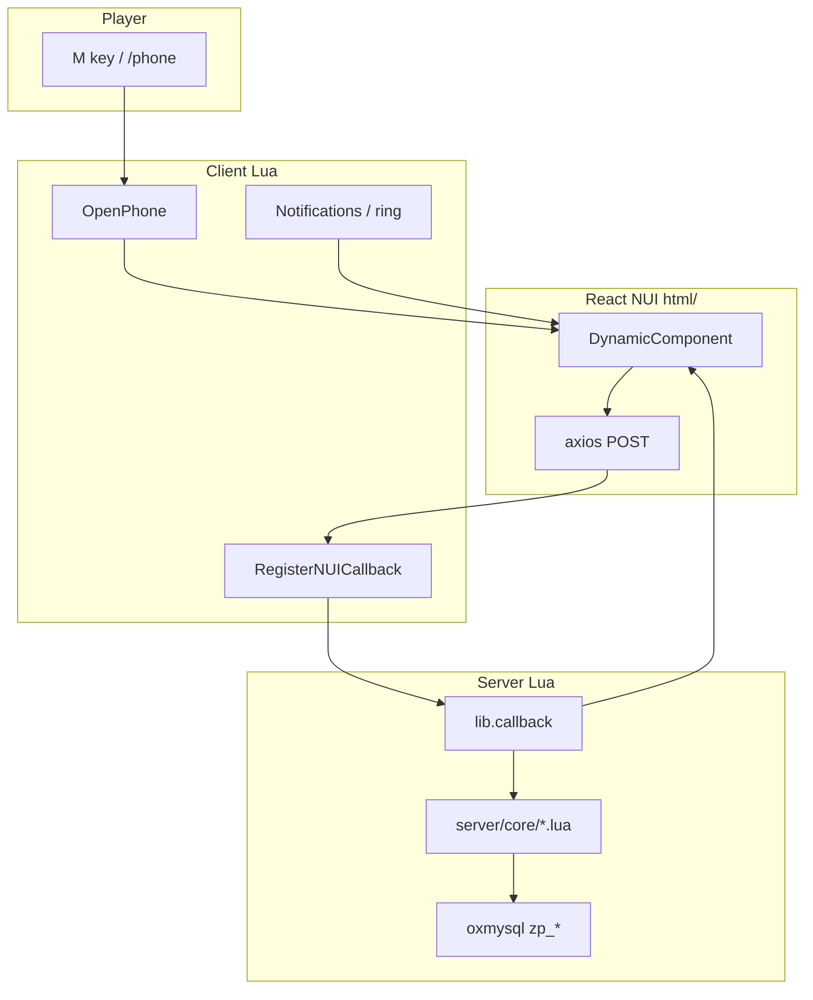

# Z-Phone Full Guide (Japanese RP Fork)

**Languages:** [日本語 (GUIDE-JA)](GUIDE-JA.md) · **English (GUIDE-EN)**

> **README is the TOP page** — quick install: [../README.en.md](../README.en.md) · [../README.md](../README.md) (日本語).  
> This file is the **detailed** install, config, and troubleshooting reference.

| Reader | Start here |
|--------|------------|
| Server admin | [Installation](#installation) → [server.cfg](#servercfg) → [Troubleshooting](#troubleshooting) |
| Developer | [Architecture](#architecture) → [Development](#development) → [CHANGELOG](CHANGELOG.md) |
| Localization | [Multilingual i18n](#multilingual-i18n) |

---

## Table of contents

- [Overview](#overview)
- [Improvements over upstream](#improvements-over-upstream)
- [Apps](#apps)
- [Architecture](#architecture)
- [Requirements](#requirements)
- [Installation](#installation)
- [server.cfg](#servercfg)
- [Configuration reference](#configuration-reference)
- [Multilingual i18n](#multilingual-i18n)
- [Development](#development)
- [Troubleshooting](#troubleshooting)
- [Known remaining items](#known-remaining-items)
- [Adding an app](#adding-an-app)
- [Related docs](#related-docs)

---

## Overview

| Item | Value |
|------|-------|
| Upstream | [alfaben12/z-phone](https://github.com/alfaben12/z-phone) |
| Fork | [matrix9neonebuchadnezzar2199-sketch/z-phone](https://github.com/matrix9neonebuchadnezzar2199-sketch/z-phone) |
| UI | React 18 + Vite + Tailwind CSS |
| DB | oxmysql (table prefix `zp_`) |
| Default core | QBX (`Config.Core` → QB / ESX) |
| Language | Japanese default (NUI + Lua). `Config.Locale = "en"` for English |

**This fork provides**

1. Critical / High / Medium upstream bug fixes (transfers, webhook, invoices, calls, InetMax, etc.)
2. **i18n Phase 2** — 32 NUI components + ~60 server notification keys
3. Security — InetMax server authority (C-03), PayInvoice / min transfer validation
4. Locale foundation — `locales/en.lua` + `en.json` + `Config.Locale`
5. **Auto schema** — 16 `zp_*` tables on resource start (`Config.AutoInstallSchema`)

---

## Improvements over upstream

Commit history: [CHANGELOG.md](CHANGELOG.md)

### Critical

| ID | Upstream issue | Fix |
|----|----------------|-----|
| C-01 | `addAccountMoney` called `RemoveMoney` | Fixed to `AddMoney` |
| C-02 | Hardcoded Discord webhook | convar `zphone_discord_webhook` |
| C-03 | InetMax deduction via trusted client NetEvent | Server `DeductInetMaxUsage` |

### High

| ID | Upstream issue | Fix |
|----|----------------|-----|
| H-01 | QBX invoice stub | Wired to `phone_invoices` |
| H-02 | IBAN lookup charinfo error | Uses `ReceiverPlayer.name` |
| H-03 | goverment / government typo | Both aliases |
| H-04 | PayInvoice used client `amount` | Validates DB `invoice.amount` |
| H-05 | Call end callback nil Player | Nil guards + `playerDropped` |

### Medium (selected)

| ID | Fix |
|----|-----|
| M-01–M-08 | NUI refactor, unified ring, conversationid notifications |
| M-09 | Server `MIN_TRANSFER` enforcement |
| M-10 | InetMax deduct only after successful callback |
| M-11 | Restore all fields when reopening incoming call |
| M-12 | GetChats `GROUP BY c.id` |
| M-13 | Clear `InCalls` on disconnect |

### i18n / polish

| Item | Detail |
|------|--------|
| Phase 1 | Japanese config, `locales/ja.lua`, react-i18next |
| Phase 2 | `ja.json` ~250 keys, all NUI, Lua `L()` notifications |
| Phase 5 base | `en.json` / `locales/en.lua`, `profile.locale` sync |
| Email | Transfer / InetMax / Loops emails via `L("email_*")` |
| L-01 | Per-job Services logos |

---

## Apps

### Home & dock (always visible)

| App | Description |
|-----|-------------|
| Phone | History, requests, in/out calls (pma-voice) |
| Messages | DM, groups, read state |
| Camera | Capture → Discord URL → gallery |
| Settings | Avatar, wallpaper, anonymous, DND |

### Grid apps

| App | Description | Notes |
|-----|-------------|-------|
| Contacts | CRUD, proximity share | Within 2m |
| Mail | Inbox (Markdown) | No send UI |
| Ads | Bulletin board | Uses InetMax |
| Services | Job inquiries | Per-job logos |
| Garage | Vehicle list | View only |
| Houses | Properties + GPS | Key UI not implemented |
| Wallet | Balance, transfer, bills | IBAN transfer, min $20,000 |
| Loops | SNS | Login, posts, DM |
| News | Feed + live | Job permission required |
| Photos | Gallery | Camera integration |
| InetMax | Data plan | Server-side deduction on use |

### Notifications & lock screen

| Feature | Description |
|---------|-------------|
| Lock screen | First screen when OPEN; swipe up for home |
| Incoming call | OPEN/CLOSE; answer / decline |
| New message | Banner + CLOSED preview |
| Internal notify | Transfers, InetMax low, etc. |

---

## Architecture



| Direction | Mechanism |
|-----------|-----------|
| Lua → NUI | `SendNUIMessage({ event = 'z-phone', ... })` |
| NUI → Lua | `axios.post('/endpoint')` → `RegisterNUICallback` |
| Voice | pma-voice (`call_id`) |
| InetMax | Server `DeductInetMaxUsage` (after successful callback only) |

**Server load order:** `server/00a_schema.lua` → `server/00_inetmax_usage.lua` → core / feature / main.

---

## Requirements

### FiveM / framework

| Item | Notes |
|------|-------|
| FiveM artifacts | Latest recommended (Lua 5.4) |
| Framework | QBCore / QBX / ESX |
| Inventory | ox_inventory (QBX assumed) |

### Required resources

| Resource | Purpose |
|----------|---------|
| [ox_lib](https://github.com/overextended/ox_lib) | callbacks / notify |
| [oxmysql](https://github.com/overextended/oxmysql) | database |
| [ox_inventory](https://github.com/overextended/ox_inventory) | `phone` item |
| [qb-core](https://github.com/qbcore-framework/qb-core) | QBX / QB |
| [qb-banking](https://github.com/qbcore-framework/qb-banking) | banking |
| [pma-voice](https://github.com/AvarianKnight/pma-voice) | calls |
| [screenshot-basic](https://github.com/citizenfx/screenshot-basic) | camera |
| interact-sound | ringtones |

`fxmanifest.lua` dependencies: ox_lib, oxmysql, pma-voice

### Development (UI changes)

Node.js 18+ / npm 9+

---

## Installation

### 1. Download & placement

```powershell
git clone https://github.com/matrix9neonebuchadnezzar2199-sketch/z-phone.git
```

Place under `resources/`. Folder name = `ensure` name (e.g. `z-phone`).

> Resource rename is handled by `GetParentResourceName()` (I-05). Custom builds: check `web/src/main.jsx`.

### 2. ensure order

```cfg
ensure ox_lib
ensure oxmysql
ensure ox_inventory
ensure qb-core
ensure qb-banking
ensure pma-voice
ensure screenshot-basic
ensure interact-sound
ensure z-phone
```

### 3. Database

**Default (recommended):** Keep `Config.AutoInstallSchema = true` and `ensure z-phone`.  
On start, after oxmysql connects, 16 `zp_*` tables are created with `CREATE TABLE IF NOT EXISTS`.

Success log (F8 / server console):

```
[z-phone] Database schema ready (16 tables, AutoInstallSchema)
```

**Manual import (optional):** If your DBA manages schema, set in `config/config.lua`:

```lua
Config.AutoInstallSchema = false
```

Then:

```bash
mysql -u USER -p DATABASE < z-phone.sql
```

> `z-phone.sql` includes **DROP TABLE** — do not run on production DBs with existing data.

QBX/QB bills tab also needs **`phone_invoices`** (outside z-phone scope).

### 4. Ringtones (required)

[Upstream steps](https://github.com/alfaben12/z-phone#required-import-sound) — copy from `html/sounds/` to interact-sound:

| File | Use |
|------|-----|
| `ringing.ogg` | Incoming |
| `zpcall.ogg` | Outgoing ringback |
| `monkeyopening.ogg` | New message |

---

## server.cfg

```cfg
# Camera webhook (required — C-02)
setr zphone_discord_webhook "https://discord.com/api/webhooks/YOUR_ID/YOUR_TOKEN"
```

Create webhook in Discord → Server Settings → Integrations. **Never hardcode in source.**

---

## Configuration reference

### config/config.lua

```lua
Config.Core = "QBX"       -- "QB" | "ESX" | "QBX"
Config.OpenPhone = 'M'
Config.Locale = "ja"        -- "en" for English UI (NUI + Lua)
Config.AutoInstallSchema = true  -- false = manual z-phone.sql import
Config.Wallet.MinTransfer = 20000
```

| Block | Purpose |
|-------|---------|
| `Config.App.InetMax` | Data plan on/off, top-up rates, per-action usage |
| `Config.Signal` | Dead zones (optional) |
| `Config.Services` | Job names, logo URLs, types |
| `Config.Msg*` | Messages via `L()` |

### web/public/static/config.json

After build: `html/static/config.json`. **Always `npm run build` after edits.**

```json
{
  "name": "Carrier Name",
  "timezone": "Asia/Tokyo",
  "WALLET": { "MIN_TRANSFER": 20000 },
  "SERVICES": { "ALLOWED_JOBS": ["police", "ambulance", "government"] },
  "NEWS": { "ALLOWED_JOBS": ["reporter", "government", "ambulance"] }
}
```

### server/core/*.lua (server-specific)

| File | Customize |
|------|-----------|
| `qbx.lua` / `qb.lua` | Vehicles, houses, bank history, invoice queries |
| `esx.lua` | ESX (Society stub — I-02) |

### locales/

| File | Role |
|------|------|
| `init.lua` | `L(key, ...)` helper |
| `ja.lua` | Japanese (default) |
| `en.lua` | Overrides when `Config.Locale == "en"` |

---

## Multilingual i18n

### Lua (notifications & email)

```lua
Config.Locale = "ja"   -- or "en"
```

Keys in `locales/ja.lua` / `locales/en.lua` — use `L("notify_*")` / `L("email_*")`.

### NUI (React)

- Files: `web/src/i18n/locales/ja.json` / `en.json`
- Components: `useTranslation()` → `t("wallet.transfer.submit")`
- On profile fetch: `i18n.changeLanguage(profile.locale)` from server `Config.Locale`

### Switch to English UI

1. `Config.Locale = "en"` in `config/config.lua`
2. Restart resource (NUI picks up locale on next open)
3. Optionally edit `config.json` labels → `npm run build`

---

## Development

```powershell
cd web
npm install
npm run build
```

Output: `html/` (`ui_page` in fxmanifest)

**Hot reload (dev):**

```lua
-- temporary fxmanifest change
ui_page "http://localhost:5173"
```

```powershell
cd web
npm run dev
```

---

## Troubleshooting

| Symptom | Cause | Fix |
|---------|-------|-----|
| Phone won't open | Weapon / no phone item | Holster; grant item |
| Camera fails | Webhook unset | `setr zphone_discord_webhook` |
| Wrong balance after transfer | C-01 old build | Use latest fork |
| Empty bills | No `phone_invoices` | Create table + data |
| IBAN lookup error | H-02 old build | Use latest fork |
| Services not delivered | Job name mismatch | `config.json` ALLOWED_JOBS |
| No ringtone | interact-sound | Copy sounds (§4) |
| Blank NUI | Not built | `npm run build` |
| Out of data | InetMax 0 | Top up in InetMax app |
| InetMax increases (exploit) | C-03 old build | Latest fork (server authority) |
| Schema not created | AutoInstall off / oxmysql | Check convar; `Config.AutoInstallSchema` |

**Debug:** F8 → `Config.Debug = true`

---

## Known remaining items

| Item | Notes |
|------|-------|
| **Live FiveM test** | Code complete; server verification only |
| **L-02** Lovy / Play TV | Not on home screen (by design) |
| **L-03** MENU_RACE | UI not implemented |
| **I-02** ESX Society | Stub on ESX only |

---

## Adding an app

1. `config.json` — APPS + MENUS
2. `menu.js` — export constants
3. React component
4. `DynamicComponent.jsx` — routing
5. `App.jsx` — fetch handlers
6. `client/feature/*.lua` — NUICallback
7. `server/feature/*.lua` — lib.callback
8. `npm run build`

---

## Related docs

| File | Description |
|------|-------------|
| [../README.en.md](../README.en.md) | TOP (English) |
| [../README.md](../README.md) | TOP (日本語) |
| [GUIDE-JA.md](GUIDE-JA.md) | Full guide (日本語) |
| [CHANGELOG.md](CHANGELOG.md) | Changelog |
| [alfaben12/z-phone](https://github.com/alfaben12/z-phone) | Upstream README |

---

<p align="center"><sub>Based on <a href="https://github.com/alfaben12/z-phone">alfaben12/z-phone</a> · <a href="GUIDE-JA.md">日本語</a></sub></p>
