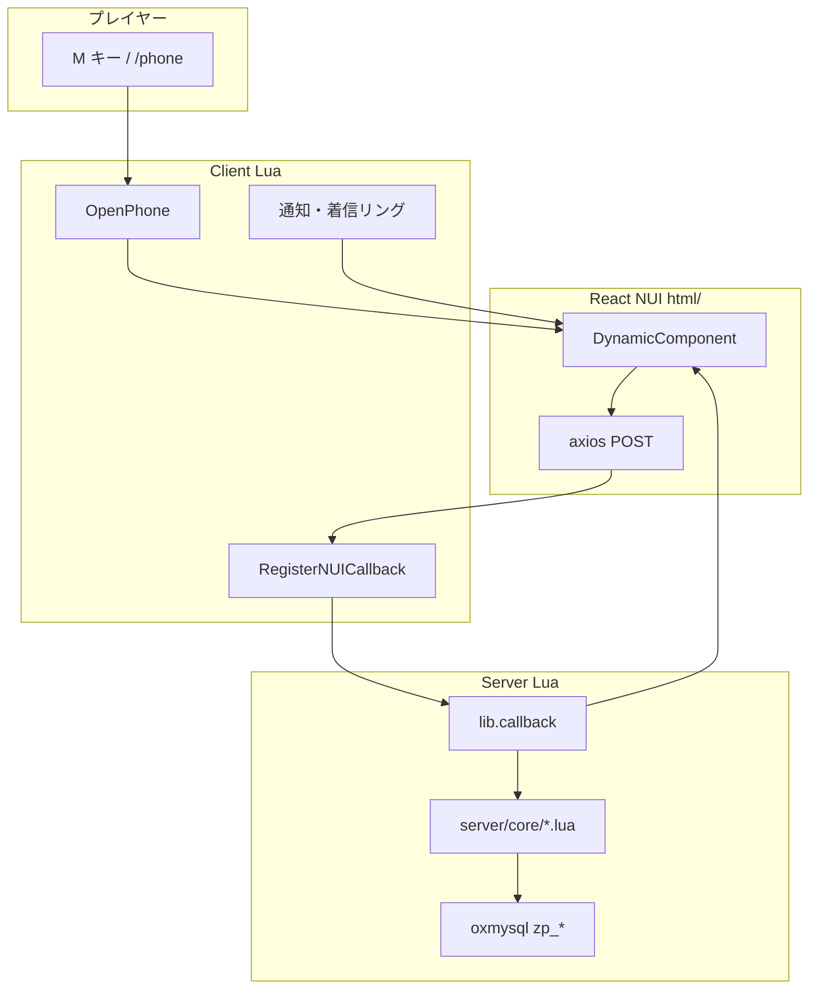

# Z-Phone 詳細ガイド（日本語 RP 向けフォーク）

**Languages:** **日本語 (GUIDE-JA)** · [English (GUIDE-EN)](GUIDE-EN.md)

> **README が TOP ページ** — 最短導入は [../README.md](../README.md) · [../README.en.md](../README.en.md) (English)。  
> 本ファイルは設計・設定・トラブルシューティングの**詳細版**です。

| 読者 | 最初に読む章 |
|------|-------------|
| サーバー管理者 | [インストール](#インストール) → [servercfg](#servercfg) → [トラブルシューティング](#トラブルシューティング) |
| 開発者 | [システム構成](#システム構成) → [開発](#開発) → [CHANGELOG](CHANGELOG.md) |
| 翻訳担当 | [多言語 i18n](#多言語-i18n) |

---

## 目次

- [概要](#概要)
- [本家からの改善点](#本家からの改善点)
- [アプリ一覧](#アプリ一覧)
- [システム構成](#システム構成)
- [必要条件](#必要条件)
- [インストール](#インストール)
- [server.cfg](#servercfg)
- [設定リファレンス](#設定リファレンス)
- [多言語 i18n](#多言語-i18n)
- [開発](#開発)
- [トラブルシューティング](#トラブルシューティング)
- [既知の残課題](#既知の残課題)
- [アプリを追加する](#アプリを追加する)
- [関連ドキュメント](#関連ドキュメント)

---

## 概要

| 項目 | 内容 |
|------|------|
| ベース | [alfaben12/z-phone](https://github.com/alfaben12/z-phone) |
| フォーク | [matrix9neonebuchadnezzar2199-sketch/z-phone](https://github.com/matrix9neonebuchadnezzar2199-sketch/z-phone) |
| UI | React 18 + Vite + Tailwind CSS |
| DB | oxmysql（テーブル接頭辞 `zp_`） |
| デフォルト Core | QBX（`Config.Core` で QB / ESX に切替） |
| 言語 | 日本語デフォルト（NUI + Lua 通知）。`Config.Locale = "en"` で英語 |

**本フォークが提供するもの**

1. 本家 Critical / High / Medium バグ修正（送金・Webhook・請求書・通話・InetMax 等）
2. **i18n Phase 2 完了** — NUI 32 コンポーネント + サーバー通知 ~60 件
3. セキュリティ強化 — InetMax server 権威化（C-03）、PayInvoice / 送金下限検証
4. 多言語基盤 — `locales/en.lua` + `en.json` + `Config.Locale`
5. **DB 自動作成** — 起動時 16 テーブル（`Config.AutoInstallSchema`）

---

## 本家からの改善点

詳細なコミット履歴: [CHANGELOG.md](CHANGELOG.md)

### Critical

| ID | 本家の問題 | 対応 |
|----|-----------|------|
| C-01 | `addAccountMoney` が `RemoveMoney` を呼ぶ | `AddMoney` に修正 |
| C-02 | Discord Webhook ハードコード | convar `zphone_discord_webhook` |
| C-03 | InetMax 減算がクライアント信頼 NetEvent | `DeductInetMaxUsage` server 権威化 |

### High

| ID | 本家の問題 | 対応 |
|----|-----------|------|
| H-01 | QBX 請求書スタブ | `phone_invoices` 接続 |
| H-02 | IBAN 確認の charinfo エラー | `ReceiverPlayer.name` |
| H-03 | goverment / government 表記ゆれ | 両エイリアス |
| H-04 | PayInvoice が client `amount` で残高チェック | DB `invoice.amount` で検証 |
| H-05 | 通話終了 callback の nil Player | nil ガード + `playerDropped` |

### Medium（抜粋）

| ID | 対応 |
|----|------|
| M-01〜M-08 | NUI リファクタ・着信リング統合・conversationid 通知 |
| M-09 | 送金 `MIN_TRANSFER` server 検証 |
| M-10 | InetMax 成功時のみ減算 |
| M-11 | CLOSED 着信 → OPEN 時フィールド復元 |
| M-12 | GetChats `GROUP BY c.id` |
| M-13 | `InCalls` disconnect 解放 |

### i18n / 仕上げ

| 項目 | 内容 |
|------|------|
| Phase 1 | config 日本語、`locales/ja.lua`、`react-i18next` |
| Phase 2 | `ja.json` ~250 キー、全 NUI コンポーネント、Lua 通知 `L()` |
| Phase 5 基盤 | `en.json` / `locales/en.lua`、`profile.locale` 連動 |
| メール | 送金 / InetMax / Loops 確認メールを `L("email_*")` 化 |
| L-01 | Services 職種別 logo |

---

## アプリ一覧

### ホーム・ドック（常時表示）

| アプリ | 説明 |
|--------|------|
| 電話 | 履歴・リクエスト・発信/着信（pma-voice） |
| メッセージ | DM・グループ・既読 |
| カメラ | 撮影 → Discord URL → ギャラリー |
| 設定 | アバター・壁紙・匿名・DND |

### グリッドアプリ

| アプリ | 説明 | 備考 |
|--------|------|------|
| 連絡先 | CRUD・近距離共有 | 2m 以内で共有 |
| メール | 受信閲覧（Markdown） | 送信 UI なし |
| 広告 | 掲示板 | InetMax 消費 |
| サービス | 職業問い合わせ | 職種別 logo |
| ガレージ | 車両一覧 | 閲覧のみ |
| 物件 | 住宅・GPS | 鍵 UI 未実装 |
| ウォレット | 残高・送金・請求書 | IBAN 送金、下限 $20,000 |
| Loops | SNS | ログイン・投稿・DM |
| ニュース | フィード・ライブ | job 権限要 |
| 写真 | ギャラリー | カメラ連携 |
| InetMax | 通信量 | 利用時 server 減算 |

### 通知・ロック画面

| 機能 | 説明 |
|------|------|
| ロック画面 | OPEN 時最初の画面。上スワイプでホーム |
| 着信 | OPEN/CLOSE 両対応。応答 / 拒否 |
| 新着メッセージ | バナー + CLOSED 時プレビュー |
| 内部通知 | 送金・InetMax 不足等 |

---

## システム構成



| 方向 | 手段 |
|------|------|
| Lua → NUI | `SendNUIMessage({ event = 'z-phone', ... })` |
| NUI → Lua | `axios.post('/endpoint')` → `RegisterNUICallback` |
| 通話音声 | pma-voice（`call_id`） |
| InetMax | server `DeductInetMaxUsage`（成功 callback のみ） |

**server スクリプト読込順:** `server/00a_schema.lua` → `server/00_inetmax_usage.lua` → core / feature / main。

---

## 必要条件

### FiveM / フレームワーク

| 項目 | 備考 |
|------|------|
| FiveM artifacts | 最新推奨（Lua 5.4） |
| フレームワーク | QBCore / QBX / ESX |
| インベントリ | ox_inventory（QBX 想定） |

### 必須リソース

| リソース | 用途 |
|----------|------|
| [ox_lib](https://github.com/overextended/ox_lib) | callback / notify |
| [oxmysql](https://github.com/overextended/oxmysql) | DB |
| [ox_inventory](https://github.com/overextended/ox_inventory) | phone アイテム |
| [qb-core](https://github.com/qbcore-framework/qb-core) | QBX / QB |
| [qb-banking](https://github.com/qbcore-framework/qb-banking) | 銀行 |
| [pma-voice](https://github.com/AvarianKnight/pma-voice) | 通話 |
| [screenshot-basic](https://github.com/citizenfx/screenshot-basic) | カメラ |
| interact-sound | 着信音 |

`fxmanifest.lua` の `dependencies`: ox_lib, oxmysql, pma-voice

### 開発（UI 変更時）

Node.js 18+ / npm 9+

---

## インストール

### 1. 取得と配置

```powershell
git clone https://github.com/matrix9neonebuchadnezzar2199-sketch/z-phone.git
```

`resources` 配下に配置。フォルダ名 = `ensure` 名。

> リネーム時は `GetParentResourceName()` が自動解決（I-05）。カスタムビルド時のみ `web/src/main.jsx` を確認。

### 2. ensure 順

```cfg
ensure ox_lib
ensure oxmysql
ensure ox_inventory
ensure qb-core
ensure qb-banking
ensure pma-voice
ensure screenshot-basic
ensure interact-sound
ensure z-phone
```

### 3. データベース

**デフォルト（推奨）:** `Config.AutoInstallSchema = true` のまま `ensure z-phone` するだけ。  
リソース起動時に oxmysql 接続後、`zp_*` テーブル 16 件を `CREATE TABLE IF NOT EXISTS` で自動作成します。

F8 / サーバーコンソールに次が出れば成功:

```
[z-phone] Database schema ready (16 tables, AutoInstallSchema)
```

**手動 import（任意）:** DBA が SQL を管理する場合は `config/config.lua` で:

```lua
Config.AutoInstallSchema = false
```

そのうえで:

```bash
mysql -u USER -p DATABASE < z-phone.sql
```

> `z-phone.sql` は **DROP TABLE 付き**の Navicat ダンプです。既存データがある DB では流さないでください。

QBX/QB で請求書を使う場合は **`phone_invoices`** も必要（z-phone 管轄外）。

### 4. 着信音（必須）

[本家手順](https://github.com/alfaben12/z-phone#required-import-sound) — `html/sounds/` を interact-sound へコピー:

| ファイル | 用途 |
|----------|------|
| `ringing.ogg` | 着信 |
| `zpcall.ogg` | 発信リングバック |
| `monkeyopening.ogg` | 新着メッセージ |

---

## server.cfg

```cfg
# カメラ Webhook（必須 — C-02）
setr zphone_discord_webhook "https://discord.com/api/webhooks/YOUR_ID/YOUR_TOKEN"
```

Discord → サーバー設定 → 連携 → Webhook から URL を取得。**ソースに直書きしないこと。**

---

## 設定リファレンス

### config/config.lua

```lua
Config.Core = "QBX"       -- "QB" | "ESX" | "QBX"
Config.OpenPhone = 'M'
Config.Locale = "ja"        -- "en" で英語 UI（NUI + Lua）
Config.AutoInstallSchema = true  -- false = 手動 z-phone.sql import
Config.Wallet.MinTransfer = 20000
```

| ブロック | 内容 |
|----------|------|
| `Config.App.InetMax` | 通信量 ON/OFF、トップアップレート、各操作の消費量 |
| `Config.Signal` | 圏外ゾーン（任意） |
| `Config.Services` | 職種名・logo URL・type |
| `Config.Msg*` | `L()` 経由の日本語メッセージ |

### web/public/static/config.json

ビルド後は `html/static/config.json`。変更後は **必ず `npm run build`**。

```json
{
  "name": "キャリア名",
  "timezone": "Asia/Tokyo",
  "WALLET": { "MIN_TRANSFER": 20000 },
  "SERVICES": { "ALLOWED_JOBS": ["police", "ambulance", "government"] },
  "NEWS": { "ALLOWED_JOBS": ["reporter", "government", "ambulance"] }
}
```

### server/core/*.lua（サーバー固有）

| ファイル | 調整対象 |
|----------|----------|
| `qbx.lua` / `qb.lua` | 車両・住宅・銀行履歴・請求書クエリ |
| `esx.lua` | ESX 用（Society スタブあり — I-02） |

### locales/

| ファイル | 役割 |
|----------|------|
| `init.lua` | `L(key, ...)` ヘルパー |
| `ja.lua` | 日本語（デフォルト） |
| `en.lua` | `Config.Locale == "en"` 時に上書き |

---

## 多言語 i18n

### Lua（通知・メール）

`config/config.lua`:

```lua
Config.Locale = "ja"   -- または "en"
```

`locales/ja.lua` / `locales/en.lua` のキーを `L("notify_*")` / `L("email_*")` で参照。

### NUI（React）

- 翻訳ファイル: `web/src/i18n/locales/ja.json` / `en.json`
- コンポーネント: `useTranslation()` → `t("wallet.transfer.submit")`
- プロフィール取得時に `i18n.changeLanguage(profile.locale)`（`Config.Locale` を server から返却）

### 英語 UI に切り替える手順

1. `config/config.lua` で `Config.Locale = "en"`
2. リソース再起動（NUI は次回 OPEN 時に locale 反映）
3. 必要なら `config.json` ラベルも英語に編集 → `npm run build`

---

## 開発

```powershell
cd web
npm install
npm run build
```

出力: `html/`（`fxmanifest.lua` の `ui_page`）

**Hot Reload（開発時）:**

```lua
-- fxmanifest.lua を一時変更
ui_page "http://localhost:5173"
```

```powershell
cd web
npm run dev
```

---

## トラブルシューティング

| 症状 | 原因 | 対処 |
|------|------|------|
| 電話が開かない | 武器 / phone なし | 武器をしまう。アイテム付与 |
| カメラ失敗 | Webhook 未設定 | `setr zphone_discord_webhook` |
| 送金後残高異常 | C-01 未修正ビルド | 本フォーク最新版を使用 |
| 請求書が空 | `phone_invoices` なし | テーブル・データ確認 |
| IBAN 確認エラー | H-02 未修正 | 本フォーク最新版 |
| Services 届かない | job 名不一致 | `config.json` ALLOWED_JOBS |
| 着信音なし | interact-sound | §着信音コピー |
| NUI 真っ白 | 未ビルド | `npm run build` |
| 通信量不足 | InetMax 0 | InetMax でトップアップ |
| InetMax が増える | C-03 exploit | 本フォーク最新版（server 権威化） |

**デバッグ:** F8 コンソール → `Config.Debug = true`

---

## 既知の残課題

| 項目 | 備考 |
|------|------|
| **FiveM 実機検証** | コード上は完了。サーバーでの動作確認のみ残 |
| **L-02** Lovy / Play TV | ホーム未配置（仕様） |
| **L-03** MENU_RACE | UI 未実装 |
| **I-02** ESX Society | ESX 環境のみスタブ |

---

## アプリを追加する

コミュニティ開発・PR 向けの**正本**は専用ガイドです（Step 0 設計〜 Step 8 ビルド、InetMax / セキュリティチェックリスト、RP アプリ案）。

| ガイド | 内容 |
|--------|------|
| **[ADDING-APP.md](ADDING-APP.md)** | **完全版（日本語）** |
| [ADDING-APP-EN.md](ADDING-APP-EN.md) | English |

**8 ステップ概要**

1. 設計 — ID・DB・job・InetMax・通知  
2. `config.json` — `APPS` + `MENUS`  
3. `menu.js` — export  
4. React — `*Component.jsx` + `MenuContext`  
5. `DynamicComponent.jsx` + `App.jsx` — `axios.post` でデータ取得  
6. `client/feature/*.lua` — `RegisterNUICallback`  
7. `server/feature/*.lua` — `lib.callback` + `DeductInetMaxUsage` + `00a_schema`  
8. i18n + `npm run build`

新規 DB は `server/00a_schema.lua` の `SCHEMA` に `CREATE TABLE IF NOT EXISTS` を追記（`zp_` 接頭辞）。外部 API は server のみ。

---

## 関連ドキュメント

| ファイル | 内容 |
|----------|------|
| [../README.md](../README.md) | TOP（日本語） |
| [../README.en.md](../README.en.md) | TOP (English) |
| [ADDING-APP.md](ADDING-APP.md) | アプリ追加（日本語） |
| [ADDING-APP-EN.md](ADDING-APP-EN.md) | Adding apps (English) |
| [GUIDE-EN.md](GUIDE-EN.md) | Full guide (English) |
| [CHANGELOG.md](CHANGELOG.md) | 変更履歴（英語） |
| [alfaben12/z-phone](https://github.com/alfaben12/z-phone) | 本家 README |

---

<p align="center"><sub>Based on <a href="https://github.com/alfaben12/z-phone">alfaben12/z-phone</a></sub></p>
